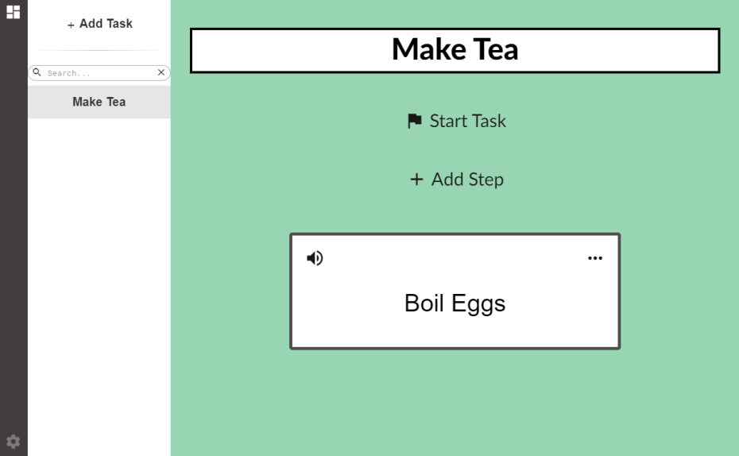

# ByteBuddy

ByteBuddy is the perfect buddy for your elderly friend who needs help remembering to turn off their stove, take their medication, and more! 


<p align="center">
     
</p>

## :pushpin: Features

* Create simple routines for daily life skills
* Add timers for tasks related to cooking and clearning
* Easy to read interface with audio support for elderly people

## :scroll: Install

Install [Node.js](https://nodejs.org/en/). Open up a terminal and clone the project with [Git](https://git-scm.com/), `cd` into the project root folder and install all dependencies:

```
git clone https://github.com/hikikones/Lazycard.git
cd Lazycard
npm install
```

## :wrench: Usage

The following commands are used for development and building:

| Node.js command | Description |
|-----------------|-------------|
| `npm start` | Builds the project in development mode and launches `Electron`. |
